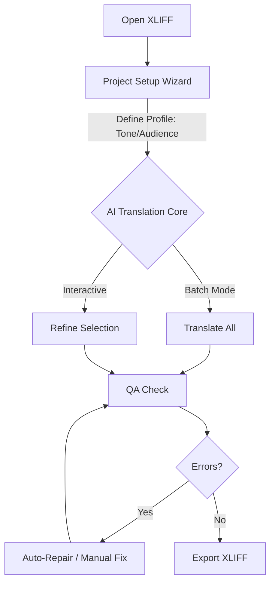

<p align="center">
  <a href="README.md">
    
  </a>
  <a href="README.zh-CN.md">
    
  </a>
</p>

# XLIFF AI Assistant

An AI-assisted XLIFF workbench that aims to feel like a CAT tool where it matters most: **structure safety** (inline tags), **local QA**, and **reliable write-back**.


</p>

XLIFF AI Assistant bridges traditional CAT workflows and modern LLMs. It focuses on translating and repairing XLIFF while preserving tag structure so files remain valid for re-import into tools like memoQ/Trados.

---

## 📋 Table of Contents

- [Workflow](#-workflow)
- [Quick Start](#-quick-start)
- [Core Features](#-core-features)
- [How Tag Safety Works](#-how-tag-safety-works)
- [Architecture](#-architecture)
- [Configuration](#-configuration)
- [Testing](#-testing)
- [Limitations](#-limitations--non-goals)
- [Contributing](#-contributing)
- [License](#-license)

---

## 🔄 Workflow



> **Note**: If the diagram above does not render, the workflow is:
> 1. **Open XLIFF**: Import file from your CAT tool.
> 2. **Profile Setup**: Configure audience, tone, and terminology to guide the AI engine.
> 3. **AI Translation Core**:
>    - **Translate All**: Batch process the entire file using the defined profile.
>    - **Refine**: Interactively improve specific segments (e.g., "Make it shorter", "Fix grammar").
> 4. **QA Check**: Verify tag integrity and empty targets.
> 5. **Repair**: Fix errors automatically or manually.
> 6. **Export**: Save valid XLIFF for re-import.

---

## 🚀 Quick Start

### For Users

1.  **Download**: Get the latest release (or run from source).
2.  **Run**:
    - Modern UI: run `run_modern.bat`
    - Legacy UI: run `run_desktop.bat`
3.  **Open**: Click **📂 Open** and select your `.xlf` file.
4.  **Setup**: Follow the **Project Setup Wizard** to define your translation profile.
5.  **Go**: Use **Translate All** or select one/multiple rows and run **Translate** / **Fix Tags**.

### For Developers

1.  **Clone**:
    ```bash
    git clone https://github.com/rushiruhua17/Xliff-AI-Translation.git
    cd xliff-ai-assistant
    ```
2.  **Install**:
    ```bash
    pip install -r requirements.txt
    ```
3.  **Run**:
    ```bash
    python -m ui.modern.main_window
    ```
    Or use `run_modern.bat` / `run_desktop.bat` on Windows.

---

## ✨ Core Features

### 🖥️ Workbench
- **Data Safety First**: Atomic save operations ensure your file is never corrupted, even during a crash.
- **Crash Recovery**: Automatically detects abnormal shutdowns and offers to recover unsaved progress from autosave.
- **Smart UI**: Debounced row expansion for smooth navigation; persistent column visibility settings.
- **Multi-selection**: Shift range select and Ctrl multi-select; batch actions operate on the selected segments.

### 🧠 AI Integration
- **Profile Wizard**: Define "Target Audience", "Tone", and "Strictness" to guide the AI.
- **Context-Aware**: Uses your profile to generate prompts dynamically.
- **Multi-Provider**: Supports **SiliconFlow**, **OpenAI**, and **DeepSeek**.
- **Per-task models**: Configure different models for translation vs tag repair vs profile analysis.

### 🛡️ QA & Repair
- **Tag Protection**: Abstracts XML tags (e.g., `<bpt id="1">`) to preventing AI hallucinations.
- **Readiness Panel**: Real-time health check (Errors/Warnings) before export.
- **Fix Tags (auto-apply)**: Repairs missing/extra placeholders and writes back immediately, then re-runs QA.
- **Batch Repair**: Repairs selected segments (or all QA errors) in one run.

---

## 🔒 How Tag Safety Works

This project treats inline tags as structural objects, similar to CAT tools:

1. **Parse XLIFF with lxml** and extract each segment’s inner XML: [parser.py](file:///f:/XLIFF%20AI%20Assistant/xliff_ai_assistant/core/parser.py)
2. **Abstract inline tags to placeholders** `{1}`, `{2}`, … and store a per-segment mapping `tags_map`: [abstractor.py](file:///f:/XLIFF%20AI%20Assistant/xliff_ai_assistant/core/abstractor.py), [xliff_inline_tags.py](file:///f:/XLIFF%20AI%20Assistant/xliff_ai_assistant/core/xliff_inline_tags.py)
3. **Token-safe translation**:
   - If a segment contains `{n}`, split by known placeholders, translate chunks with full context, then deterministically reassemble with the original placeholders.
   - If the model returns invalid chunk output, fall back to classic whole-segment JSON translation.
   - Always validate structure before applying results. See: [token_safe_translation.py](file:///f:/XLIFF%20AI%20Assistant/xliff_ai_assistant/core/token_safe_translation.py), [workers.py](file:///f:/XLIFF%20AI%20Assistant/xliff_ai_assistant/core/workers.py), [validator.py](file:///f:/XLIFF%20AI%20Assistant/xliff_ai_assistant/core/validator.py)
4. **Repair (Fix Tags)** focuses on placeholder correctness and applies fixes immediately, then re-runs QA: [repair.py](file:///f:/XLIFF%20AI%20Assistant/xliff_ai_assistant/core/repair.py), [qa_service.py](file:///f:/XLIFF%20AI%20Assistant/xliff_ai_assistant/core/services/qa_service.py)
5. **Write back** reconstructed XML using lxml dummy-root parsing to keep mixed content stable: [parser.py](file:///f:/XLIFF%20AI%20Assistant/xliff_ai_assistant/core/parser.py)

---

## 🏗 Architecture

- **Input**: Standard XLIFF 1.2 files (commonly used in Trados, memoQ).
- **UI**:
  - Modern UI: [ui/modern/main_window.py](file:///f:/XLIFF%20AI%20Assistant/xliff_ai_assistant/ui/modern/main_window.py)
  - Legacy UI (reference/compat): [desktop_app.py](file:///f:/XLIFF%20AI%20Assistant/xliff_ai_assistant/desktop_app.py)
- **Core**:
  - **Parser** (lxml): [parser.py](file:///f:/XLIFF%20AI%20Assistant/xliff_ai_assistant/core/parser.py)
  - **Tag abstraction**: [abstractor.py](file:///f:/XLIFF%20AI%20Assistant/xliff_ai_assistant/core/abstractor.py)
  - **QA & Repair**: [qa.py](file:///f:/XLIFF%20AI%20Assistant/xliff_ai_assistant/core/qa.py), [repair.py](file:///f:/XLIFF%20AI%20Assistant/xliff_ai_assistant/core/repair.py)
  - **Workers (translation/refine/profile)**: [workers.py](file:///f:/XLIFF%20AI%20Assistant/xliff_ai_assistant/core/workers.py)
  - **Autosaver**: [autosave.py](file:///f:/XLIFF%20AI%20Assistant/xliff_ai_assistant/core/autosave.py)
- **Output**: Validated XLIFF files ready for re-import.

---

## ⚙ Configuration

Go to the **Settings** tab (Model Services) to configure:

1. **Model Profiles**: Define multiple model profiles (provider/base_url/model/api_key).
2. **Task Mapping**: Assign a profile per task:
   - `translation`: main translation
   - `repair`: tag repair (Fix Tags / Batch Repair)
   - `profile_analysis`: profile generation (optional)
   See: [app_config.py](file:///f:/XLIFF%20AI%20Assistant/xliff_ai_assistant/core/config/app_config.py), [model_page.py](file:///f:/XLIFF%20AI%20Assistant/xliff_ai_assistant/ui/modern/settings/model_page.py)

> **Security Note**: API Keys are stored locally in `QSettings` (OS Registry/Config). Never commit your keys to version control.

---

## 🧪 Testing

```bash
pytest -q
```

## 🚫 Limitations / Non-goals

- **Not a CAT Tool**: We do not provide Translation Memory (TM) or Termbase (TB) management. Use your CAT tool for that.
- **No Project Management**: This is a single-file workbench, not a project management server.
- **AI Dependencies**: Output quality depends on the LLM used. Always review critical translations.

---

## 🤝 Contributing

Contributions are welcome!

1.  Fork the repository.
2.  Create a feature branch (`git checkout -b feature/amazing-feature`).
3.  Commit your changes (`git commit -m 'Add amazing feature'`).
4.  Push to the branch (`git push origin feature/amazing-feature`).
5.  Open a Pull Request.

---

## 📄 License

Distributed under the MIT License. See `LICENSE` for more information.
