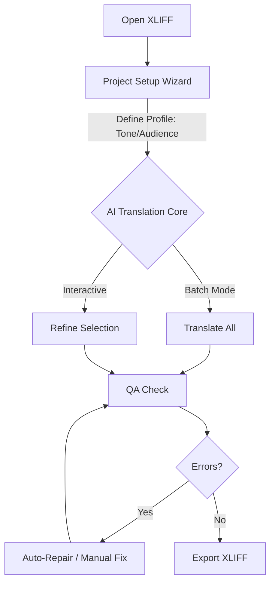

<p align="center">
  <a href="README.md">
    
  </a>
  <a href="README.zh-CN.md">
    
  </a>
</p>

# XLIFF AI Assistant

> **Your Intelligent Workbench for XLIFF Translation & Refinement**
> 
> *Not just a translator, but a precision tool for modern localization workflows.*


</p>

XLIFF AI Assistant is a specialized desktop application that bridges the gap between traditional CAT tools and modern Large Language Models (LLMs). It allows professional translators to leverage AI for translation, QA, and content repair without sacrificing the structural integrity of XLIFF files.

---

## 📋 Table of Contents

- [Workflow](#-workflow)
- [Quick Start](#-quick-start)
- [Core Features](#-core-features)
- [Architecture](#-architecture)
- [Configuration](#-configuration)
- [Limitations](#-limitations--non-goals)
- [Contributing](#-contributing)
- [License](#-license)

---

## 🔄 Workflow



> **Note**: If the diagram above does not render, the workflow is:
> 1. **Open XLIFF**: Import file from your CAT tool.
> 2. **Profile Setup**: Configure audience, tone, and terminology to guide the AI engine.
> 3. **AI Translation Core**:
>    - **Translate All**: Batch process the entire file using the defined profile.
>    - **Refine**: Interactively improve specific segments (e.g., "Make it shorter", "Fix grammar").
> 4. **QA Check**: Verify tag integrity and empty targets.
> 5. **Repair**: Fix errors automatically or manually.
> 6. **Export**: Save valid XLIFF for re-import.

---

## 🚀 Quick Start

### For Users

1.  **Download**: Get the latest release (or use the provided `run_desktop.bat` if you have the source).
2.  **Run**: Double-click `XLIFF AI Assistant.exe` or execute the batch file.
3.  **Open**: Click **📂 Open** and select your `.xlf` file.
4.  **Setup**: Follow the **Project Setup Wizard** to define your translation profile.
5.  **Go**: Click **🚀 Translate All** or select rows to translate interactively.

### For Developers

1.  **Clone**:
    ```bash
    git clone https://github.com/rushiruhua17/Xliff-AI-Translation.git
    cd xliff-ai-assistant
    ```
2.  **Install**:
    ```bash
    pip install -r requirements.txt
    ```
3.  **Run**:
    ```bash
    python desktop_app.py
    ```

---

## ✨ Core Features

### 🖥️ Workbench
- **Data Safety First**: Atomic save operations ensure your file is never corrupted, even during a crash.
- **Crash Recovery**: Automatically detects abnormal shutdowns and offers to recover unsaved progress from autosave.
- **Smart UI**: Debounced row expansion for smooth navigation; persistent column visibility settings.

### 🧠 AI Integration
- **Profile Wizard**: Define "Target Audience", "Tone", and "Strictness" to guide the AI.
- **Context-Aware**: Uses your profile to generate prompts dynamically.
- **Multi-Provider**: Supports **SiliconFlow**, **OpenAI**, and **DeepSeek**.

### 🛡️ QA & Repair
- **Tag Protection**: Abstracts XML tags (e.g., `<bpt id="1">`) to preventing AI hallucinations.
- **Readiness Panel**: Real-time health check (Errors/Warnings) before export.
- **Batch Auto-Repair**: Optional agent to fix tag mismatches automatically.

---

## 🏗 Architecture

- **Input**: Standard XLIFF 1.2 files (commonly used in Trados, memoQ).
- **Core**:
    - **Parser**: Robust XML handling with tag abstraction.
    - **Autosaver**: Background thread for change tracking and crash recovery.
    - **Profile Engine**: State-machine based profile management (`NEW` -> `DRAFT` -> `CONFIRMED`).
- **Output**: Validated XLIFF files ready for re-import.

---

## ⚙ Configuration

Go to the **Settings** tab to configure:

1.  **AI Provider**: Set API Key and Base URL (e.g., SiliconFlow / OpenAI).
2.  **Model**: Choose your preferred model (e.g., `deepseek-ai/DeepSeek-V2.5`, `gpt-4o`).
3.  **Language**: Set default Source and Target languages.
4.  **Auto-Repair**: Enable/Disable the secondary repair agent.

> **Security Note**: API Keys are stored locally in `QSettings` (OS Registry/Config). Never commit your keys to version control.

---

## 🚫 Limitations / Non-goals

- **Not a CAT Tool**: We do not provide Translation Memory (TM) or Termbase (TB) management. Use your CAT tool for that.
- **No Project Management**: This is a single-file workbench, not a project management server.
- **AI Dependencies**: Output quality depends on the LLM used. Always review critical translations.

---

## 🤝 Contributing

Contributions are welcome!

1.  Fork the repository.
2.  Create a feature branch (`git checkout -b feature/amazing-feature`).
3.  Commit your changes (`git commit -m 'Add amazing feature'`).
4.  Push to the branch (`git push origin feature/amazing-feature`).
5.  Open a Pull Request.

---

## 📄 License

Distributed under the MIT License. See `LICENSE` for more information.
