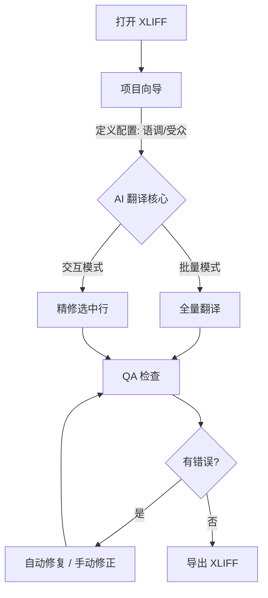

<p align="center">
  <a href="README.md">
    
  </a>
  <a href="README.zh-CN.md">
    
  </a>
</p>

# XLIFF AI Assistant

一款 AI 辅助的 XLIFF 桌面工作台，目标是在关键点上更像 CAT 工具：**结构安全（内联标签）**、**本地 QA**、以及**可靠写回**。


</p>

XLIFF AI Assistant 连接传统 CAT 工作流与现代大语言模型（LLM），重点解决“翻译/修复 XLIFF 但不破坏 tag 结构”的问题，确保输出可被 memoQ/Trados 等工具重新导入。

---

## 📋 目录

- [工作流](#-工作流)
- [快速开始](#-快速开始)
- [核心功能](#-核心功能)
- [Tag 安全机制](#-tag-安全机制)
- [架构设计](#-架构设计)
- [配置说明](#-配置说明)
- [测试](#-测试)
- [限制与非目标](#-限制与非目标)
- [参与贡献](#-参与贡献)
- [许可证](#-许可证)

---

## 🔄 工作流



> **注意**: 如果上方图表无法渲染，工作流如下：
> 1. **打开 XLIFF**: 导入从 CAT 工具导出的文件。
> 2. **项目设置**: 配置受众、语调和术语策略，为 AI 引擎提供上下文。
> 3. **AI 翻译核心**:
>    - **全量翻译**: 使用定义的配置文件批量处理整个文件。
>    - **精修**: 交互式地改进特定句段（例如“更简洁一点”、“修复语法”）。
> 4. **QA 检查**: 验证标签完整性和空译文。
> 5. **修复**: 自动或手动修复标签错误。
> 6. **导出**: 保存合法的 XLIFF 以供重新导入。

---

## 🚀 快速开始

### 用户指南

1.  **下载**: 获取最新发布版本（或从源码运行）。
2.  **运行**:
    - 现代界面（Modern UI）：运行 `run_modern.bat`
    - 旧版界面（Legacy UI）：运行 `run_desktop.bat`
3.  **打开**: 点击 **📂 Open** 并选择您的 `.xlf` 文件。
4.  **设置**: 跟随 **Project Setup Wizard** 定义您的翻译配置。
5.  **开始**: 使用 **Translate All** 或多选行后运行 **Translate / Fix Tags**。

### 开发者指南

1.  **克隆**:
    ```bash
    git clone https://github.com/rushiruhua17/Xliff-AI-Translation.git
    cd xliff-ai-assistant
    ```
2.  **安装**:
    ```bash
    pip install -r requirements.txt
    ```
3.  **运行**:
    ```bash
    python -m ui.modern.main_window
    ```
    或在 Windows 上直接运行 `run_modern.bat` / `run_desktop.bat`。

---

## ✨ 核心功能

### 🖥️ 工作台
- **数据安全第一**: 原子化保存操作确保即使在崩溃时，您的文件也不会损坏。
- **崩溃恢复**: 自动检测异常关闭，并提供从自动保存中恢复进度的选项。
- **智能 UI**: 防抖动的行展开逻辑，带来丝滑导航体验；持久化的列显示设置。
- **多选批处理**: 支持 Shift 连选、Ctrl 增删选中；批量操作作用于选中的句段。

### 🧠 AI 集成
- **项目向导**: 定义“目标受众”、“语调”和“严格度”以引导 AI。
- **上下文感知**: 根据您的配置文件动态生成提示词。
- **多供应商**: 支持 **SiliconFlow**, **OpenAI**, 和 **DeepSeek**。
- **按任务分配模型**: translation / repair / profile_analysis 可分别绑定不同模型（成本/质量分级）。

### 🛡️ QA 与修复
- **标签保护**: 抽象 XML 标签（如 `<bpt id="1">`）以防止 AI 产生幻觉。
- **就绪面板**: 导出前的实时健康检查（错误/警告）。
- **Fix Tags（自动应用）**: 修复缺失/多余占位符并立刻写回 Target，然后重跑 QA。
- **批量修复**: 对选中句段（或所有 QA error）一键修复。

---

## 🔒 Tag 安全机制

本项目把内联标签当成结构对象处理（类似 CAT 工具）：\n\n1. **用 lxml 解析 XLIFF**，提取每个 segment 的 inner XML：[parser.py](file:///f:/XLIFF%20AI%20Assistant/xliff_ai_assistant/core/parser.py)\n2. **内联标签抽象为占位符** `{1}`、`{2}`…，并保存每段独立的 `tags_map` 映射：[abstractor.py](file:///f:/XLIFF%20AI%20Assistant/xliff_ai_assistant/core/abstractor.py)、[xliff_inline_tags.py](file:///f:/XLIFF%20AI%20Assistant/xliff_ai_assistant/core/xliff_inline_tags.py)\n3. **Token-safe 翻译**：\n   - 含 `{n}` 的段落：按已知 `{n}` 切分文本块 → chunks 翻译（保留全上下文）→ 去除模型误产出的已知 `{n}` → 按原 token 序列确定性回拼\n   - 若模型 chunks 输出不合约：回退到传统“整段 JSON 翻译”\n   - 写入前强制结构校验（缺失/多余 token 不允许）\n   参考：[token_safe_translation.py](file:///f:/XLIFF%20AI%20Assistant/xliff_ai_assistant/core/token_safe_translation.py)、[workers.py](file:///f:/XLIFF%20AI%20Assistant/xliff_ai_assistant/core/workers.py)、[validator.py](file:///f:/XLIFF%20AI%20Assistant/xliff_ai_assistant/core/validator.py)\n4. **Repair（Fix Tags）** 只聚焦占位符修复，自动应用并重跑 QA：[repair.py](file:///f:/XLIFF%20AI%20Assistant/xliff_ai_assistant/core/repair.py)、[qa_service.py](file:///f:/XLIFF%20AI%20Assistant/xliff_ai_assistant/core/services/qa_service.py)\n5. **写回导出**：重建 XML 后用 lxml dummy-root 写回混合内容，保证稳定：[parser.py](file:///f:/XLIFF%20AI%20Assistant/xliff_ai_assistant/core/parser.py)\n@@


- **输入**: 标准 XLIFF 1.2 文件（常用工具：Trados, memoQ）。\n+- **UI**:\n+  - 现代 UI： [ui/modern/main_window.py](file:///f:/XLIFF%20AI%20Assistant/xliff_ai_assistant/ui/modern/main_window.py)\n+  - 旧版 UI（兼容/参考）：[desktop_app.py](file:///f:/XLIFF%20AI%20Assistant/xliff_ai_assistant/desktop_app.py)\n+- **核心**:\n+  - **Parser（lxml）**：[parser.py](file:///f:/XLIFF%20AI%20Assistant/xliff_ai_assistant/core/parser.py)\n+  - **Tag 抽象/还原**：[abstractor.py](file:///f:/XLIFF%20AI%20Assistant/xliff_ai_assistant/core/abstractor.py)\n+  - **QA / Repair**：[qa.py](file:///f:/XLIFF%20AI%20Assistant/xliff_ai_assistant/core/qa.py)、[repair.py](file:///f:/XLIFF%20AI%20Assistant/xliff_ai_assistant/core/repair.py)\n+  - **Workers（翻译/精修/Profile）**：[workers.py](file:///f:/XLIFF%20AI%20Assistant/xliff_ai_assistant/core/workers.py)\n+  - **自动保存**：[autosave.py](file:///f:/XLIFF%20AI%20Assistant/xliff_ai_assistant/core/autosave.py)\n+- **输出**: 验证过的 XLIFF 文件，可直接重新导入。\n@@

---
前往 **Settings**（Model Services）进行配置：

1. **模型档案（Model Profiles）**：配置多个 provider/base_url/model/api_key。\n+2. **任务映射（Task Mapping）**：为不同任务绑定 profile：\n+   - `translation`：翻译\n+   - `repair`：标签修复（Fix Tags / Batch Repair）\n+   - `profile_analysis`：生成翻译配置（可选）\n+   参考：[app_config.py](file:///f:/XLIFF%20AI%20Assistant/xliff_ai_assistant/core/config/app_config.py)、[model_page.py](file:///f:/XLIFF%20AI%20Assistant/xliff_ai_assistant/ui/modern/settings/model_page.py)\n@@

> **安全提示**: API Key 本地存储在 `QSettings` (系统注册表/配置) 中。切勿将您的 Key 提交到版本控制。

---
## 🧪 测试

```bash
pytest -q
```


- **不是 CAT 工具**: 我们不提供翻译记忆库 (TM) 或术语库 (TB) 管理。请使用您的 CAT 工具处理这些。
- **不做项目管理**: 这是一个单文件工作台，不是项目管理服务器。
- **AI 依赖**: 输出质量取决于使用的 LLM。请务必人工审查关键翻译。

---

## 🤝 参与贡献

欢迎贡献代码！

1.  Fork 本仓库。
2.  创建特性分支 (`git checkout -b feature/amazing-feature`)。
3.  提交更改 (`git commit -m 'Add amazing feature'`)。
4.  推送到分支 (`git push origin feature/amazing-feature`)。
5.  提交 Pull Request。

---

## 📄 许可证

基于 MIT 许可证分发。详见 `LICENSE` 文件。
