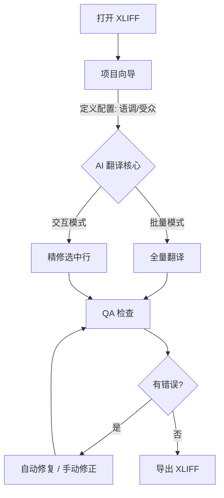

<p align="center">
  <a href="README.md">
    
  </a>
  <a href="README.zh-CN.md">
    
  </a>
</p>

# XLIFF AI Assistant

> **您的 XLIFF 翻译与精修智能工作台**
> 
> *不仅仅是翻译，更是现代本地化工作流的精密助手。*


</p>

XLIFF AI Assistant 是一款专业的桌面应用程序，旨在填补传统 CAT 工具与现代大语言模型（LLM）之间的空白。它允许专业译员利用 AI 进行翻译、质量检查（QA）和内容修复，同时严格保持 XLIFF 文件的结构完整性。

---

## 📋 目录

- [工作流](#-工作流)
- [快速开始](#-快速开始)
- [核心功能](#-核心功能)
- [架构设计](#-架构设计)
- [配置说明](#-配置说明)
- [限制与非目标](#-限制与非目标)
- [参与贡献](#-参与贡献)
- [许可证](#-许可证)

---

## 🔄 工作流



> **注意**: 如果上方图表无法渲染，工作流如下：
> 1. **打开 XLIFF**: 导入从 CAT 工具导出的文件。
> 2. **项目设置**: 配置受众、语调和术语策略，为 AI 引擎提供上下文。
> 3. **AI 翻译核心**:
>    - **全量翻译**: 使用定义的配置文件批量处理整个文件。
>    - **精修**: 交互式地改进特定句段（例如“更简洁一点”、“修复语法”）。
> 4. **QA 检查**: 验证标签完整性和空译文。
> 5. **修复**: 自动或手动修复标签错误。
> 6. **导出**: 保存合法的 XLIFF 以供重新导入。

---

## 🚀 快速开始

### 用户指南

1.  **下载**: 获取最新发布版本（或使用源码中的 `run_desktop.bat`）。
2.  **运行**: 双击 `XLIFF AI Assistant.exe` 或运行批处理文件。
3.  **打开**: 点击 **📂 Open** 并选择您的 `.xlf` 文件。
4.  **设置**: 跟随 **Project Setup Wizard** 定义您的翻译配置。
5.  **开始**: 点击 **🚀 Translate All** 或选择行进行交互式翻译。

### 开发者指南

1.  **克隆**:
    ```bash
    git clone https://github.com/rushiruhua17/Xliff-AI-Translation.git
    cd xliff-ai-assistant
    ```
2.  **安装**:
    ```bash
    pip install -r requirements.txt
    ```
3.  **运行**:
    ```bash
    python desktop_app.py
    ```

---

## ✨ 核心功能

### 🖥️ 工作台
- **数据安全第一**: 原子化保存操作确保即使在崩溃时，您的文件也不会损坏。
- **崩溃恢复**: 自动检测异常关闭，并提供从自动保存中恢复进度的选项。
- **智能 UI**: 防抖动的行展开逻辑，带来丝滑导航体验；持久化的列显示设置。

### 🧠 AI 集成
- **项目向导**: 定义“目标受众”、“语调”和“严格度”以引导 AI。
- **上下文感知**: 根据您的配置文件动态生成提示词。
- **多供应商**: 支持 **SiliconFlow**, **OpenAI**, 和 **DeepSeek**。

### 🛡️ QA 与修复
- **标签保护**: 抽象 XML 标签（如 `<bpt id="1">`）以防止 AI 产生幻觉。
- **就绪面板**: 导出前的实时健康检查（错误/警告）。
- **批量自动修复**: 可选的智能代理，自动修复标签不匹配问题。

---

## 🏗 架构设计

- **输入**: 标准 XLIFF 1.2 文件（常用工具：Trados, memoQ）。
- **核心**:
    - **Parser**: 具有标签抽象功能的鲁棒 XML 处理。
    - **Autosaver**: 后台线程负责变更追踪和崩溃恢复。
    - **Profile Engine**: 基于状态机的配置管理 (`NEW` -> `DRAFT` -> `CONFIRMED`)。
- **输出**: 验证过的 XLIFF 文件，可直接重新导入。

---

## ⚙ 配置说明

前往 **Settings** 标签页进行配置：

1.  **AI 供应商**: 设置 API Key 和 Base URL（例如 SiliconFlow / OpenAI）。
2.  **模型**: 选择您偏好的模型（例如 `deepseek-ai/DeepSeek-V2.5`, `gpt-4o`）。
3.  **语言**: 设置默认源语言和目标语言。
4.  **自动修复**: 启用/禁用二级修复代理。

> **安全提示**: API Key 本地存储在 `QSettings` (系统注册表/配置) 中。切勿将您的 Key 提交到版本控制。

---

## 🚫 限制与非目标

- **不是 CAT 工具**: 我们不提供翻译记忆库 (TM) 或术语库 (TB) 管理。请使用您的 CAT 工具处理这些。
- **不做项目管理**: 这是一个单文件工作台，不是项目管理服务器。
- **AI 依赖**: 输出质量取决于使用的 LLM。请务必人工审查关键翻译。

---

## 🤝 参与贡献

欢迎贡献代码！

1.  Fork 本仓库。
2.  创建特性分支 (`git checkout -b feature/amazing-feature`)。
3.  提交更改 (`git commit -m 'Add amazing feature'`)。
4.  推送到分支 (`git push origin feature/amazing-feature`)。
5.  提交 Pull Request。

---

## 📄 许可证

基于 MIT 许可证分发。详见 `LICENSE` 文件。
